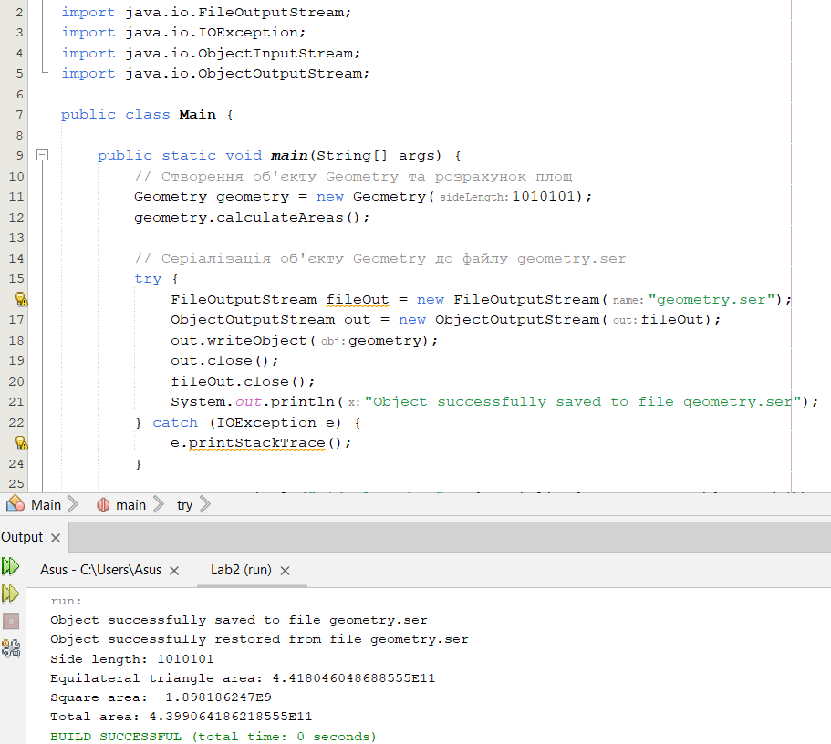

# Hordienko-Olexiy-34

+ [task_1](#task_1)
+ [task_2](#task_2)
+ [task_3](#task_3)
+ [task_4](#task_4)

## #task_1:
Завдання:

Виконати розробку найпростішої консольної програми на Java, наприклад,
що виводить на екран усі аргументи командного рядка, задані при запуску
та розмістити її у локальному сховищі.

# Результат запуску коду:

## #task_2:
Індивідуальне завдання:

Варіант №4 - Визначити суму площ рівностороннього трикутника та рівностороннього
прямокутника за заданою довжиною сторони у двійковій системі числення.

# Результат виконання програми:

## #task_3:

**Завдання:**

1. Як основа використовувати вихідний текст проекту попередньої лабораторної роботи. Забезпечити розміщення результатів обчислень уколекції з можливістю збереження/відновлення.

2. Використовуючи шаблон проектування Factory Method (Virtual Constructor), розробити ієрархію, що передбачає розширення рахунок додавання
нових відображуваних класів.

3. Розширити ієрархію інтерфейсом "фабрикованих" об'єктів, що представляє набір методів для відображення результатів обчислень.

4. Реалізувати ці методи виведення результатів у текстовому виде.

5. Розробити тареалізувати інтерфейс для "фабрикуючого" методу.

# Результат виконання завдання:

